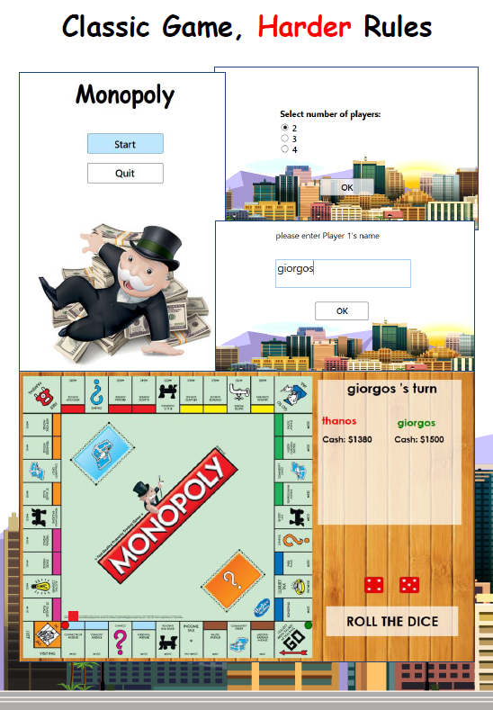

# Monopoly-CS-WPF
A new "hardcore" version of the classic game 

	

		

			
				<a href="https://github.com/sponsors/sindresorhus">My open source work is supported by the community</a>
			
		

		 
		 
	

	 
	 

	<a href="awesome.md">What is an awesome list?</a>&nbsp;&nbsp;&nbsp;
	<a href="contributing.md">Contribution guide</a>&nbsp;&nbsp;&nbsp;
	<a href="create-list.md">Creating a list</a>&nbsp;&nbsp;&nbsp;
	<a href="https://twitter.com/awesome__re">Twitter</a>&nbsp;&nbsp;&nbsp;
	<a href="https://www.redbubble.com/people/sindresorhus/works/30364188-awesome-logo">Stickers & t-shirts</a>

 

	<b>Follow the <a href="https://twitter.com/awesome__re">Awesome Twitter account</a> for updates on new list additions.</b>

 

	Just type <a href="https://awesome.re"><code>awesome.re</code></a> to go here. Check out my <a href="https://blog.sindresorhus.com">blog</a> and follow me on <a href="https://twitter.com/sindresorhus">Twitter</a>.

 
# Monopoly Hardcore Edition

## Bugs and Issues

Have a bug or an issue with this template? Send an email at blabla@blabla.gr

## Copyright and License

Copyright 2020 licence not yet

## Copyright claims
Many images used in the project belong to their respective creators/authors. No claim by me & those who use this project!!

**Thanks for reading**